# CoolE_SeeSharp

**人臉認得出是誰、車牌讀得出幾個字。** 不是只畫一個框就算完。

這是 **MIT 免費開源版**：工程師今晚就能 clone，在自己的機器上看懂整條管線。社區大門、工廠車道若要「攝影機接上、柵欄自己開、陌生人另列、半夜打你手機」——那是 [商業版](#商業版) 在賣的現場值班，不是這份 repo 的鎖。

產品名稱來自 C#（See Sharp）與「看清楚」。用 **.NET 8** 做影像工作台：內建 YuNet 找臉、SFace 認人、車牌定位＋讀字；資料集與標註也在同一個網站，訓完 YOLO 匯出 ONNX 就能換上自訓模型。相片、影片、攝影機串流走同一條管線。

[五分鐘裝起來](#五分鐘裝起來) · [它解決什麼](#它解決什麼) · [商業版](#商業版) · [IIS 安裝](docs/IIS安裝說明.md) · [街口贊助](#贊助) · [其他開源](https://github.com/pigqig/CoolE-AI-KeyFactor)

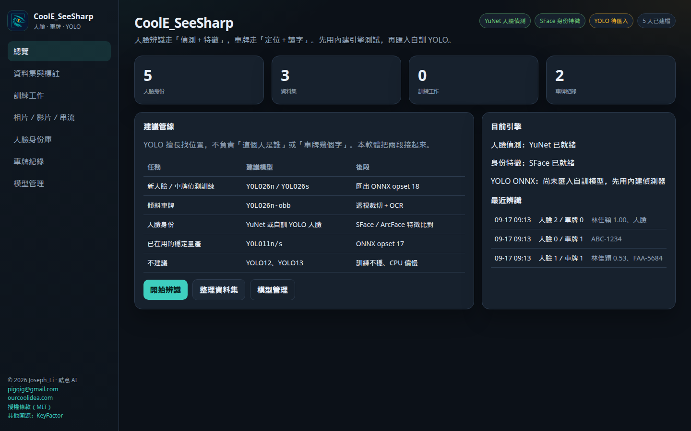

clone 之後內建示範身份與示範資料集。人臉偵測與身份特徵一開就可用；YOLO 還沒匯入時，車牌先走色彩＋輪廓，一樣能測完整流程。

---

## 它解決什麼

門禁、車道、保全值班常卡在三件事：

- **畫面裡有人，但不知道是誰。** 通用偵測只會畫框。CoolE_SeeSharp 先找臉，再用 SFace 特徵去對身份庫。
- **車過去了，車牌看不清楚。** YOLO 擅長找位置，不負責讀字。本軟體定位後接 OCR，進出還會留下紀錄。
- **想自訓現場鏡頭，卻要在 Jupyter、標註工具、訓練腳本之間跳來跳去。** 這裡從上傳、畫框、匯出 `data.yaml`、丟訓練工作、上傳 ONNX，都在同一個網站。

適用：社區／工廠大門、車道進出、櫃檯來客、保全事後調閱。不是雲端 SaaS，原始碼自己架，資料留在你的機器。

免費版適合先證明「這條管線是對的」。現場攝影機、月租放行、未知另列、進出對單，見 [商業版](#商業版)。

---

## 現場一天怎麼用

1. **人臉身份庫** — 登錄 3 張以上不同角度。示範環境已有林佳穎、陳志明等人。
2. **相片／影片／串流** — 上傳現場圖，或按「載入示範場景」先看框與身份。攝影機畫面會送到伺服器逐格推論。
3. **車牌紀錄** — 讀到的號碼、裁切圖、時間會留著，方便對進出。
4. **資料集與標註** — 上傳相片、拖曳畫框、匯出 YOLO `data.yaml`。
5. **訓練工作** — 有 GPU 且已裝 ultralytics 就真的訓；沒有則留下可複製的指令。
6. **模型管理** — 把 `best.onnx` 上傳並啟用，推論就改走你的 YOLO。

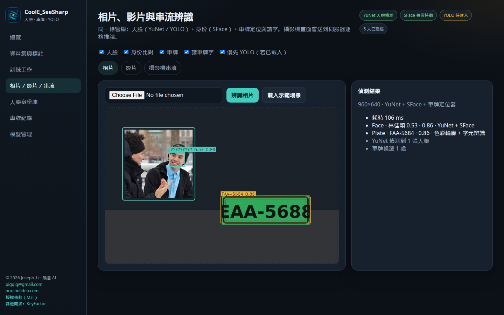

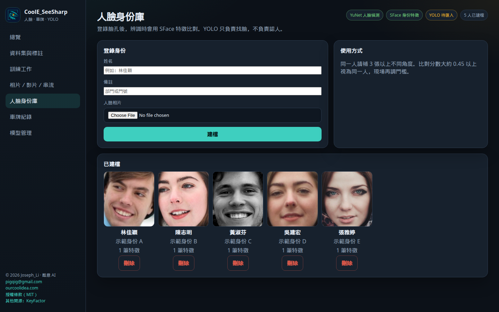

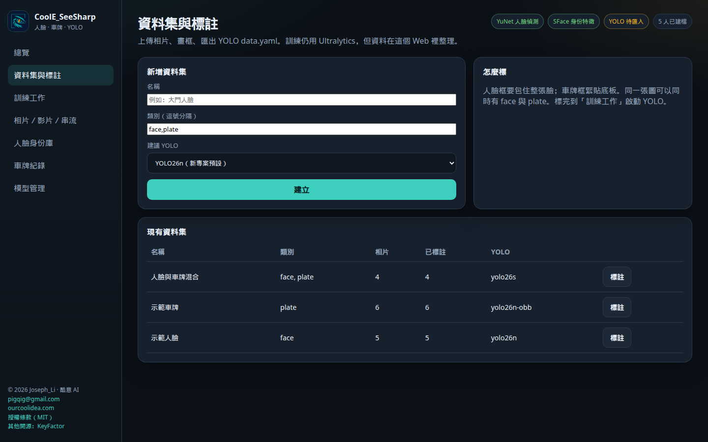

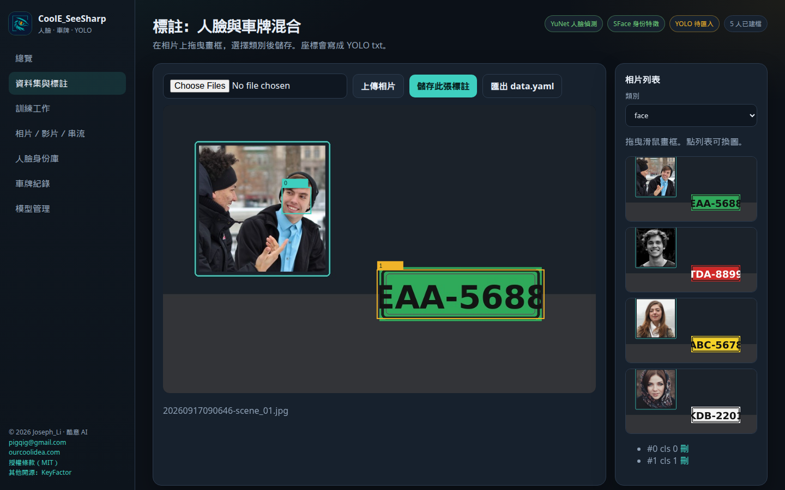

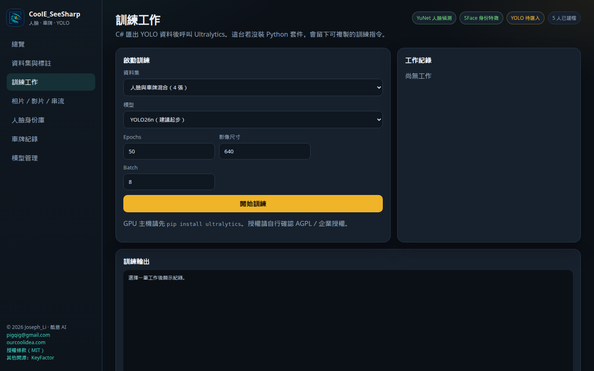

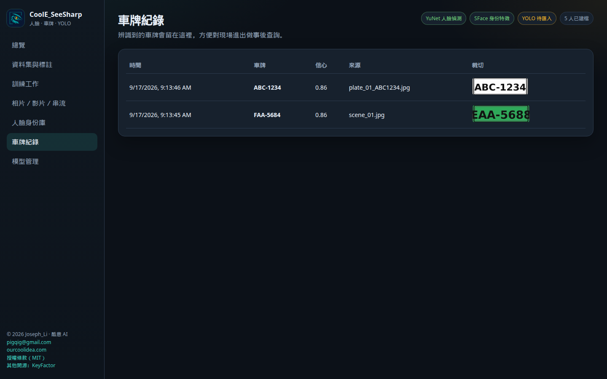

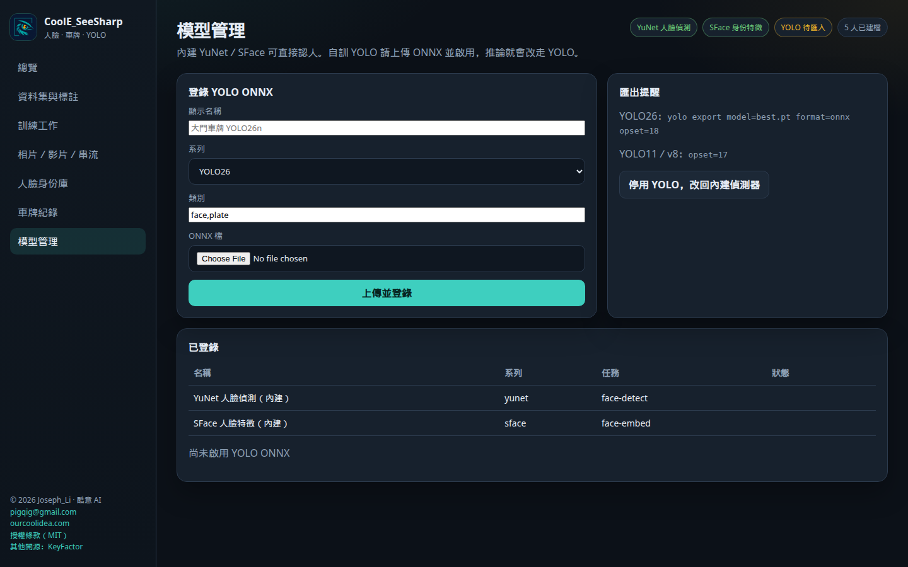

---

## 建議模型

YOLO 擅長找位置，不負責「這個人是誰」或「車牌幾個字」。本軟體把兩段接起來。

| 任務 | 建議 | 後段 |
| --- | --- | --- |
| 新人臉／車牌偵測訓練 | **YOLO26n**，不夠再升 **YOLO26s** | 匯出 ONNX opset 18 |
| 傾斜車牌 | **YOLO26n-obb** | 透視裁切＋OCR |
| 人臉「是誰」 | YuNet 或自訓 YOLO 只做人臉框 | **SFace／ArcFace** 特徵比對 |
| 車牌幾個字 | 定位後做 **OCR** | 不要用 YOLO 分類號碼 |
| 已有 YOLO11 量產 | YOLO11n／s | ONNX opset 17 |
| 不要用 | YOLO12、YOLO13 | 官方不建議量產 |

開發備註見 [docs/VISION_PLAN.md](docs/VISION_PLAN.md)（不在操作畫面）。

Ultralytics 權重多為 AGPL-3.0，商用請自行確認授權。內建 YuNet／SFace 來自 OpenCV Zoo（Apache-2.0）。

---

## 五分鐘裝起來

需要 **.NET 8 SDK**。人臉模型已放在 `models/`。建議再裝 **ffmpeg**（影片抽帧）與 **Tesseract OCR**（車牌讀字）。

```bash
git clone https://github.com/pigqig/CoolE_SeeSharp.git
cd CoolE_SeeSharp

# Debian / Ubuntu
sudo apt-get install -y ffmpeg tesseract-ocr tesseract-ocr-chi-tra

chmod +x run.sh
./run.sh
```

瀏覽器開啟 http://127.0.0.1:43173

| | |
| --- | --- |
| 想立刻看到框 | 到「相片／影片／串流」按「載入示範場景」 |
| 想認人 | 先到「人臉身份庫」看示範身份，再辨識含人臉的相片 |
| 想自訓 YOLO | 「資料集與標註」畫框 → 「訓練工作」啟動 → 「模型管理」上傳 ONNX |

Windows 本機：安裝 [.NET 8 SDK](https://dotnet.microsoft.com/download/dotnet/8.0) 後，在專案根目錄：

```powershell
cd src\VisionStudio
dotnet run --urls http://127.0.0.1:43173
```

放到 **IIS** 測試請看 [docs/IIS安裝說明.md](docs/IIS安裝說明.md)。不要把原始碼資料夾直接指成 IIS 實體路徑。

### 訓練（可選，需 GPU 較實用）

```bash
pip install ultralytics
python python/train_yolo.py --data <data.yaml> --model yolo26n --epochs 50 --imgsz 640 --project ./runs --name demo
```

YOLO26 匯出：`yolo export model=best.pt format=onnx opset=18`  
YOLO11：`opset=17`，再到「模型管理」上傳 ONNX。

---

## 商業版

免費開源版讓你在瀏覽器裡上傳相片、標註、認人、讀牌。  
商業版接到**已經裝在樑上的攝影機**：車還在動、人還在走，畫面上寫出名字與車牌。資料在客戶自己的主機，不住到別人家的雲。

開源永遠免費、永遠可改。商業版帶來的效益是：**值班少抄車牌、進出對得上單、陌生人留得下來、半夜會被叫起來**——系統商也能用安裝包交案、收年維。

以下四張是商業版現場畫面示意（與免費版同一套深色介面）。標示「畫面示意 · 商業版現場」，功能尚未做進這份開源 repo。

### 車道：月租放行、訪客對單

**效益：** 保全不必抄半張車牌；住戶不必按喇叭等對單；進出自動入表。只圈柵欄口，馬路雜車不算。

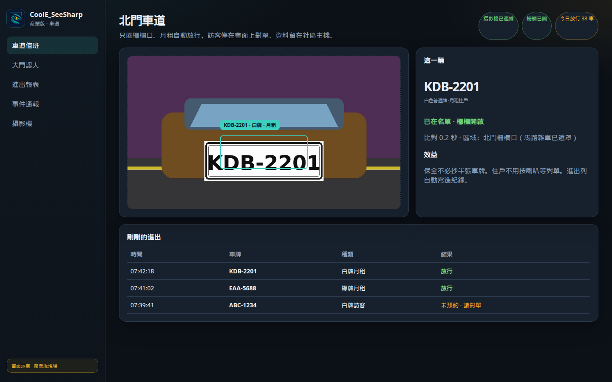

### 大門：寫出名字、未知另列

**效益：** 側臉會再試一次，對上就寫住戶名。陌生人進未知清單，不會消失。臉先自動分堆，管理室再命名，不必開學掃全棟。

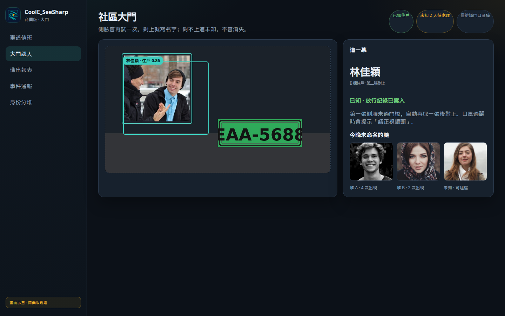

### 工廠：進出對單、稽核有表

**效益：** 車牌對進廠單、人臉對已申請外包。廠務唯讀看表，門衛刪不掉紀錄。稽核要週報時直接匯出 Excel。資料不出廠。

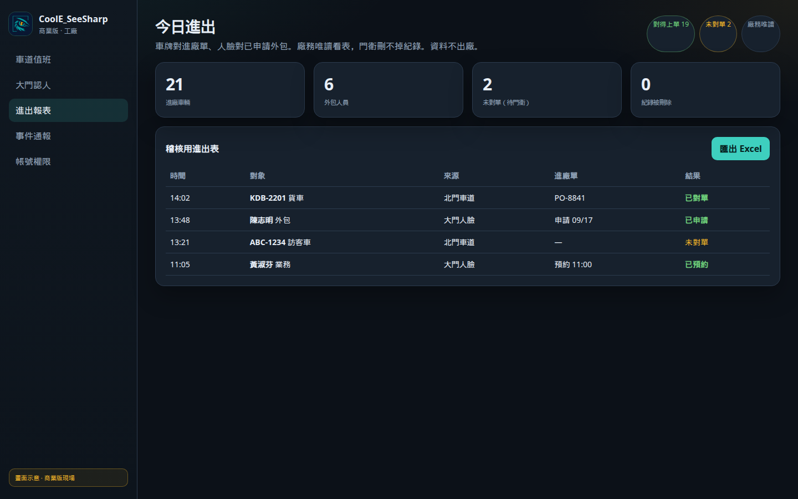

### 通報：該處理的才打到手機

**效益：** 影像留在現場主機。LINE／Email 送未知車／未知人；月租與住戶夜間只留紀錄。值班不必盯整排螢幕，早上打開的是該處理的事件。

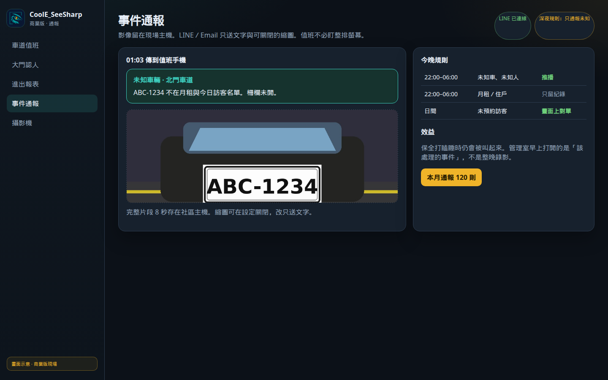

系統商交案時攝影機不用換。報的是工程款：安裝包、網頁填攝影機網址、API、白牌、一年維護。工程師可先 clone 這份開源評估。

### 付費後現場多出來的能力

| 現場要做的事 | 免費開源版 | 商業版做到的效益 |
| --- | --- | --- |
| 先看懂認人、讀牌、標註、自訓 | 今晚就能 | 同一套思路接到真攝影機 |
| 樑上那支 IP 攝影機 | 請自行接或上傳檔案 | 接上、掉線重連、只圈車道／大門 |
| 機器負載 | 示範圖即可 | 有移動才辨識；小畫面認、事件才存 |
| 月租車／訪客車 | 事後看紀錄 | 名單對上就放行；沒對上停在畫面上對單 |
| 側臉、口罩、陌生人 | 先建檔才認得出 | 多張重試、未知另列、臉先分堆再命名 |
| 半夜有狀況 | 人要盯螢幕 | LINE／Email 叫值班（影像本體仍留現場） |
| 稽核／管委會要表 | 本機紀錄 | 進出 Excel、對單結果、個資在自己機器 |
| 系統商交案 | 自己組 | 安裝包、角色帳號、API、白牌、年維 |

社區可先做車道（個資較好過票），同一場再加大門認人。工廠走年約與進出週報。通報可按月。

監視器仍是客戶的監視器。商業版加上名字、車牌、對單與通知，不是再買一套跟海康拼路數的 NVR，也不是把住戶臉孔丟上雲。

### 怎麼問商業版

郵件：[pigqig@gmail.com](mailto:pigqig@gmail.com?subject=CoolE_SeeSharp%20商業版)（主旨請寫 **CoolE_SeeSharp 商業版**，並註明社區車道／工廠大門／系統商合作）  
網站：[ourcoolidea.com](http://ourcoolidea.com)

請告訴我們場地、幾路攝影機、要認人還是先做車道。我們回能否接上你的柵欄口或大門，以及對單、通報怎麼落地到值班。

免費版請儘管 fork、改、拿去試。商業版授權是另一份合約（按據點或鏡頭，不鎖這份 MIT 原始碼）。

---

## 贊助

保全室常見這幾種早晨：

- **大門有人閃過。** 值班說「好像是住戶」，管理室說「好像是廠商」。把臉登錄進身份庫，下次框上會寫名字，不必再對口頭印象。
- **車道一輛車過去。** 警衛抄了半張車牌，辦公室對不上訪客單。讓系統定位、讀字、留下裁切圖，事後對進出比較不傷感情。
- **想自訓現場鏡頭。** 標註在這台、訓練在 GPU、ONNX 再丟回來。少開三個視窗，少掉一次「這份 yaml 是哪一版」。
- **YOLO 還在訓練。** 先用內建 YuNet／車牌偵測把流程跑通；模型好了再換成自訓 ONNX，畫面不用重做。

如果只是自己架著玩、或這份免費工作台剛好讓會議少吵一輪——願意的話，用街口請我喝杯手搖。沒有也沒關係，原始碼本來就給你架。

若你要的是柵欄自己開、陌生人另列、半夜手機會響，請走上面的 [商業版](#商業版)，那不是咖啡錢能涵蓋的現場。

1. 打開街口支付，或任何支援 TWQR 的銀行／電子支付 App
2. 掃描下方收款碼
3. 或在街口支付輸入街口代碼 **`3966`**（小言）

也可以從 GitHub 右上角 Sponsor 按鈕連到同一頁：[pigqig#sponsor](https://github.com/pigqig#sponsor)


合作、授權、商業版或客製：<pigqig@gmail.com>（主旨請寫 CoolE_SeeSharp 或 CoolE_SeeSharp 商業版）

---

## 作者

**Joseph_Li** · 酷意 AI  
郵件：[pigqig@gmail.com](mailto:pigqig@gmail.com)  
網站：[ourcoolidea.com](http://ourcoolidea.com)

也歡迎看看另一個開源專案：[CoolE-AI-KeyFactor](https://github.com/pigqig/CoolE-AI-KeyFactor)（廠務 QC 關鍵因子檢驗台）

[MIT](LICENSE) © 2026 Joseph_Li
